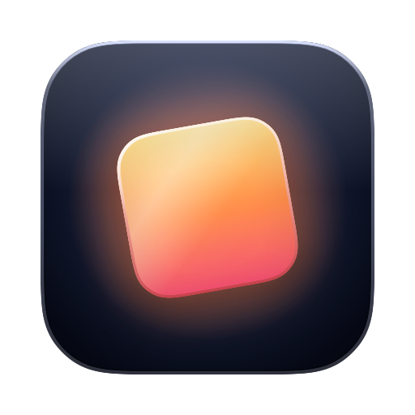

<p align="center">
  
</p>

<h1 align="center">Quick Icons</h1>

Quick Icons is a macOS app that turns **SwiftUI views into App Iconsets** you can drop straight into your Mac or iOS apps. Design an icon as a regular SwiftUI view, preview it live, and export an `AppIcon.appiconset` ready for Xcode.

## Examples

The [`Examples/`](Examples/) folder has a handful of real icons built with Quick Icons:

- `AmazonOrderExport.swift`
- `CopilotAuthenticator.swift`
- `KindleExporter.swift`
- `Scrapes.swift`
- `SlackCLI.swift`
- `QuickIcons.swift` — yes, Quick Icons' own app icon is made with Quick Icons ;)

## Editor

A simple, focused editor with **Swift syntax highlighting** and **autocompletion**, built on
[STTextView](https://github.com/krzyzanowskim/STTextView) — highlighting via
[Plugin-Neon](https://github.com/krzyzanowskim/STTextView-Plugin-Neon) and completion backed by
SourceKitten. Edit the view, see the iconset update.

## Install

With [Homebrew](https://brew.sh):

```sh
brew install --cask natikgadzhi/taps/quick-icons
```

Or grab the latest signed, notarized DMG from the
[Releases](https://github.com/natikgadzhi/quick-icons/releases) page.

Requires macOS 26 (Tahoe) or later.
